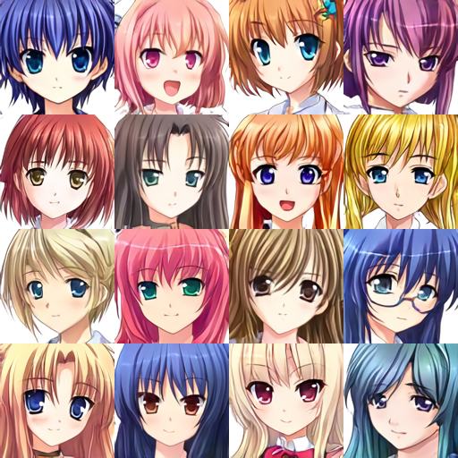

# Anime Faces Generation
* Generate anime faces at the resolution of 128px, code is available at **AnimeFaces_generation_128px.ipynb** .  
* The Frechet Inception Distance (FID) calculated from 50000 generated images using the official implementation of FID to Pytorch is **6.94**.  
* Selected generated images:  
 
  

